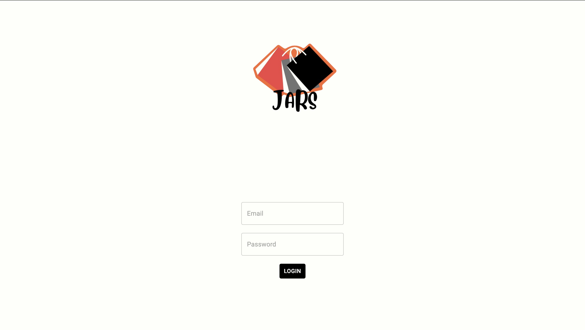
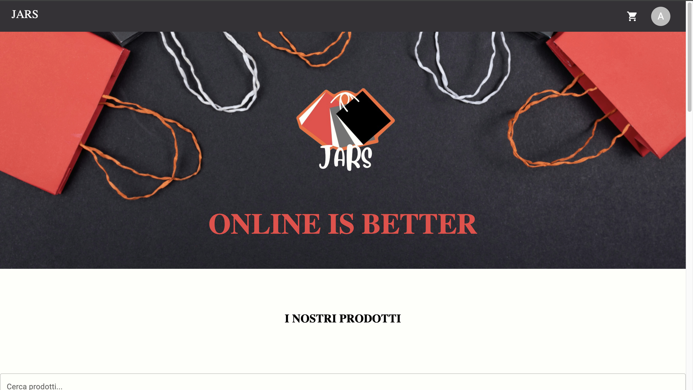
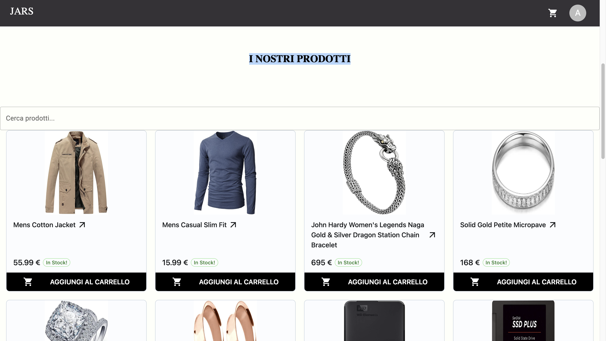
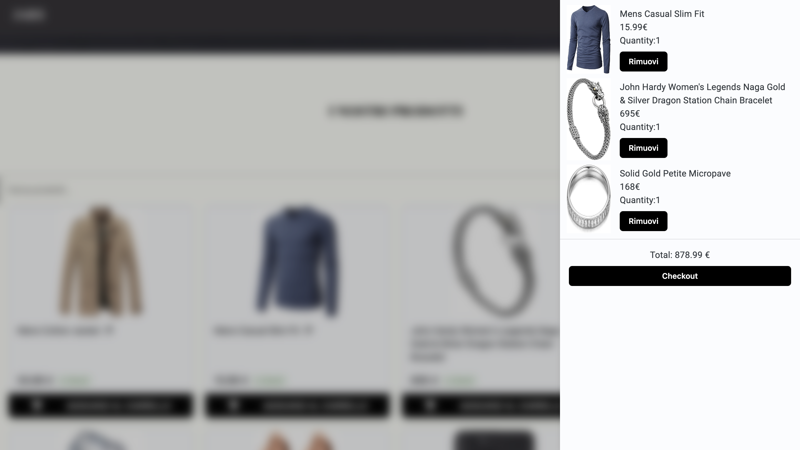
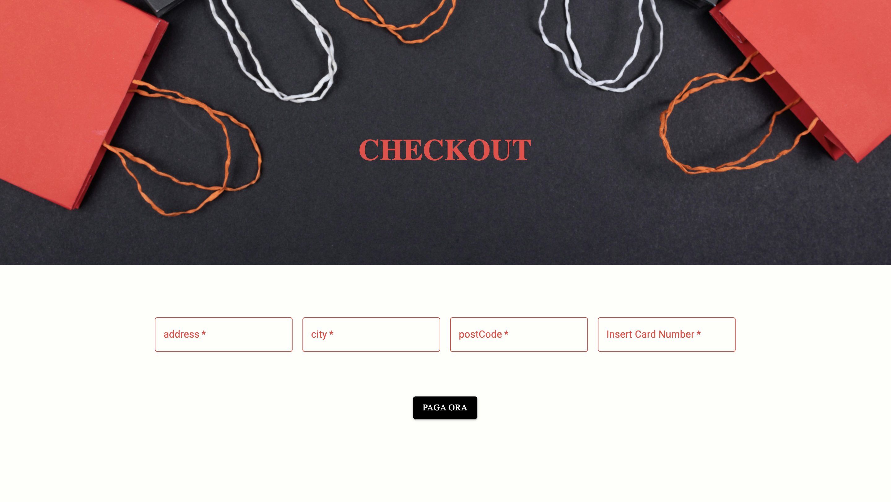
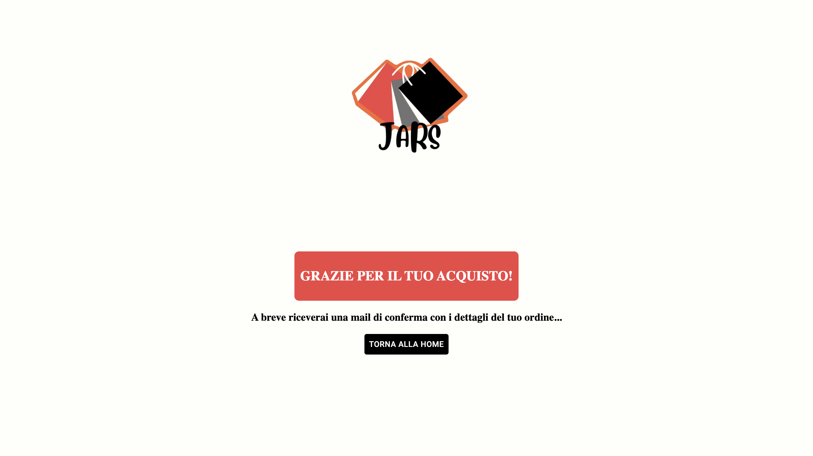
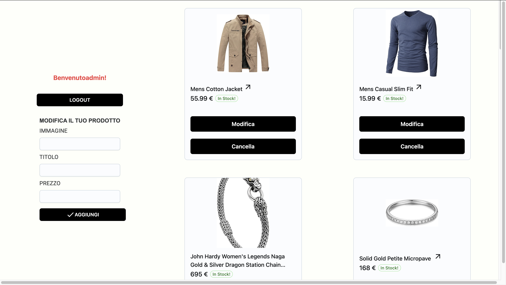

**  
Nome dell'App:** Jars

**Team Work:**
Salvatore Polizzotti
Annalisa Nasca
Rosario Fortunato
Joshua Caruso

**Descrizione del Progetto**

**Panoramica:** Jars è un'app di e-commerce sviluppata utilizzando React con TypeScript. L'app consente agli utenti di esplorare una vasta gamma di prodotti e acquistarli comodamente da casa. Il design è pulito e intuitivo, con una pagina di login per l'autenticazione degli utenti, una homepage per visualizzare tutti i prodotti disponibili, una sidebar che mostra il carrello degli acquisti e una pagina di pagamento con funzionalità di checkout.

**Caratteristiche Principali:**

1.  **Pagina di Login:** Gli utenti possono accedere o registrarsi per un nuovo account. 
3.  **Homepage:** La homepage presenta un layout accattivante con tutti i prodotti in vendita. Ogni prodotto è visualizzato con un'immagine, un titolo, il prezzo e un pulsante per aggiungerlo al carrello. Gli utenti possono sfogliare i prodotti in base alle categorie o utilizzare la barra di ricerca per trovare articoli specifici.  
    
4.  **Sidebar del Carrello:** Una sidebar, che si apre al click dell'icona del carrello sulla navbar, mostra il contenuto del carrello degli acquisti. Gli utenti possono visualizzare i prodotti aggiunti al carrello insieme al prezzo totale. Possono anche modificare la quantità o rimuovere prodotti direttamente dalla sidebar. 
    
5.  **Pagina di Pagamento con Checkout:** La pagina di pagamento è progettata per guidare gli utenti attraverso il processo di checkout in modo intuitivo. Gli utenti possono inserire le informazioni di spedizione e di pagamento in modo sicuro e completare l'ordine.  

6.  **Dashboard:** Dà la possibilità all'utente con autorizzazione Admin, di modificare ed eliminare i prodotti caricati sull'e-commerce. 
    

**Tecnologie Utilizzate:**

-   React: Una libreria JavaScript per la creazione di interfacce utente reattive.
-   TypeScript: Un superset di JavaScript che aggiunge tipi statici opzionali alla lingua.
-   React Router: Per la gestione delle rotte dell'applicazione e la navigazione tra le pagine.
-   Material-UI: Una libreria di componenti React per un design user-friendly e reattivo.
-   Context: Per la gestione dei dati dell'applicazione, inclusi prodotti, utenti e ordini.
- Local Storage: Per simulare un ambiente gli utenti interagiscono direttamente col database lato Back End.
- JsonServer: Per simulare un database in cui sono conservati i dati degli utenti e dei prodotti.

**Flusso dell'Applicazione:**

1.  L'utente atterra sulla Homepage e visualizza il contenuto principale.
2.  L'utente decide se effettuare il login tramite il pulsante collegato alla NavBar
3. Se l'utente ha un'autorizzazione di tipo Admin, può accedere alla dashboard e modificare direttamente da essa i contenuti presenti nel sito (modificando a sua volta il database).
4. L'utente può cliccare su un prodotto per espanderne i dettagli e consultarne la descrizione, ed eventualmente aggiungerlo al carrello e nel caso tornare alla home page.
5.  Sulla homepage, l'utente può sfogliare i prodotti e aggiungerli al carrello facendo clic sul pulsante "Aggiungi al Carrello".
6.  La sidebar del carrello mostra i prodotti aggiunti, consentendo all'utente di visualizzare il riepilogo degli acquisti in qualsiasi momento.
7.  Quando l'utente è pronto per effettuare un acquisto, può fare clic sul pulsante "Checkout" per procedere alla pagina di pagamento.
8.  Sulla pagina di pagamento, l'utente può inserire le informazioni di spedizione e di pagamento necessarie.
9.  Dopo aver confermato l'ordine, riceverà una conferma dell'acquisto e i dettagli dell'ordine saranno salvati nel database.

Questo progetto offre un'esperienza di shopping online intuitiva e user-friendly per gli utenti, fornendo allo stesso tempo un'interfaccia di amministrazione facile da gestire per la gestione dei prodotti e degli ordini.ugin-react) and add `plugin:react/recommended` & `plugin:react/jsx-runtime` to the `extends` list
